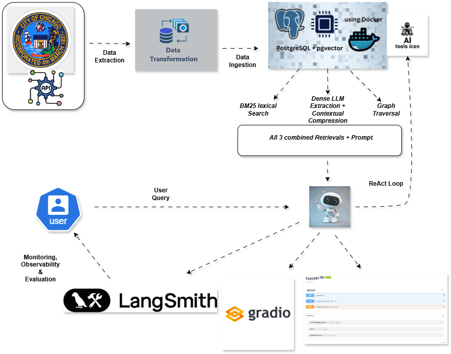
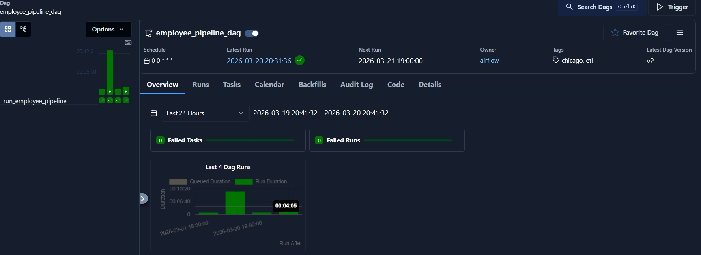
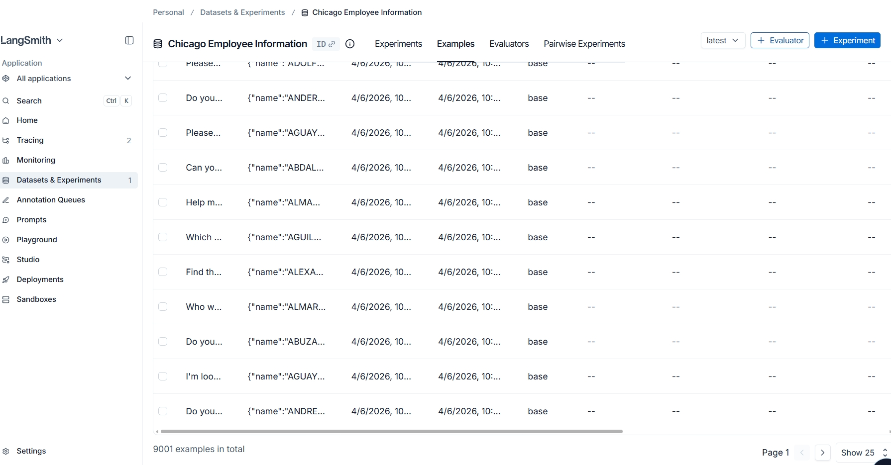
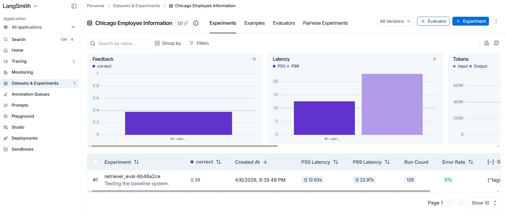

## Project Definition:  Agentic RAG for Public Sector Workforce Intelligence 

[City of Chicago Employee Dataset](https://data.cityofchicago.org/Administration-Finance/Current-Employee-Names-Salaries-and-Position-Title/xzkq-xp2w/data_preview)



### Project Overview

This project implements an ```Agentic Retrieval-Augmented Generation (RAG)``` system over the City of Chicago Current Employee Names, Salaries, and Position Titles dataset.

The dataset provides structured records of all active City of Chicago employees and includes:

***Employee full names***

***Department***

***Position title***

***Employment status (full-time / part-time)***

***Hourly frequency (e.g., 40, 35, 20, 10 hours per week)***

***Annual salary or hourly rate***

### Project Motivation

This project explores how Agentic RAG architectures can: interpret complex workforce-related queries, perform structured reasoning over tabular salary data, dynamically 

calculate derived metrics (e.g., estimated annual wages for hourly employees), plan multi-step retrieval and computation actions, decide when to retrieve, compute, or 

reformulate queries. Instead of simple document retrieval, this system treats the dataset as an actionable knowledge base, which goes beyond standard RAG by introducing 

agentic behavior.

### Environment Setup on Local Machine Terminal and Requirements Installation.

```bash
mkdir chicago_employee_data

cd chicago_employee_data

uv init

uv sync

uv add -r requirements.txt
```

### Extract, Transform and Load Data from API

* [employee-data notebook](1.ETL/employee-data.ipynb)

### ETL Pipeline Orchestration with Airflow

* [etl_pipeline](2.ETL-Airflow-Orchestration/orchestration.py)
* 
* 

```bash
uv pip install apache-airflow

uv pip freeze | grep apache-airflow

which airflow

mkdir ~/airflow/dags

cp 2.ETL-Airflow-Orchestration/orchestration.py ~/airflow/dags

ls ~/airflow/dags

airflow standalone    # localhost:8080

cat ~/airflow/simple_auth_manager_passwords.json.generated   # get airflow username and password

airflow dags list     # list running dags by dag_id

airflow dags list-import-errors  # --> to debug airflow errors
```

### Retrieval Architecture (Keyword, Dense and Graph Searches)

* [lexical-retrieval notebook](3.Retrievals/keyword_search.ipynb)
* [dense-retrieval notebook](3.Retrievals/dense_retrieval.ipynb)
* [graph-retrieval notebook](3.Retrievals/graph-retrieval.ipynb)
* [PgVector Docker-Compose file](docker-compose.yaml)

```bash
docker-compose up --build   # build and run PGvector Image
docker-compose down         # remove stopped running PGVector Container
```

### Source Codes (Python Scripts)

* [data loader script](src/data_loader.py)
* [ingestion script](src/ingestion.py)
* [text search & reranking](src/lexical_retrieval.py)
* [dense retrieval & reranking](src/dense_retrieval.py)
* [graph retreival](src/graph_retrieval.py)

```bash
uv run python src/data_loader.py
uv run python src/ingestion.py
uv run python src/lexical_retrieval.py
uv run python src/dense_retrieval.py
uv run python src/graph_retrieval.py
```

### Agentic RAG Architecture

* [Agent Tools](4.Agentic_Rag/tools.py)
* [Agentic RAG Notebook](4.Agentic_Rag/chicago_employee_rag.ipynb)


### Ground Truth Dataset (input and output pairs)

* [inputs & outputs script](5.Monitoring&Evaluation/groundtruth.py)
* [groundtruth_data](groundtruth/groundtruth_dataset.jsonl)

```bash
cd '5.Monitoring&Evaluation'
uv run python groundtruth.py
```

### Evaluation and Monitoring

* [Studio Script](5.Monitoring&Evaluation/studio/employee_agent.py)
* [evals_tools](5.Monitoring&Evaluation/studio/evals_tools.py)
* [Langgraph Json](5.Monitoring&Evaluation/studio/langgraph.json)
* [Observability & Evals notebook](5.Monitoring&Evaluation/agent-monitoring&evals.ipynb)
* [valid-reasoning-llm-judge](5.Monitoring&Evaluation/llm-as-a-judge-evals.ipynb)
* 
* 

```bash
# run langgraph Studio
cd '5.Monitoring&Evaluation'/studio
cat ../../.env      # get all environmental variables key
langgraph dev

# Kill running Langgraph
lsof -i:2024   
kill -9 65531 #(running PID)
lsof -i:2024
```

### Local Deployment with FastAPI and Gradio

```bash
uv run main.py
```

* Gradio UI : ```http://localhost:7860/ui/```
* FastAPI Endpoint: ```http://localhost:7860/docs#/```

[Employee-Logs](chicago_employee.log)

### Shared Deployment Link Using NGROK

* Sign up for an account: ```https://dashboard.ngrok.com/signup```

```bash
ngrok config add-authtoken $YOUR_AUTHTOKEN

ngrok http 7860
```
[ngrok-gradio](https://rockslide-easily-juicy.ngrok-free.dev/ui/)
[ngrok-fastapi](https://rockslide-easily-juicy.ngrok-free.dev/docs)